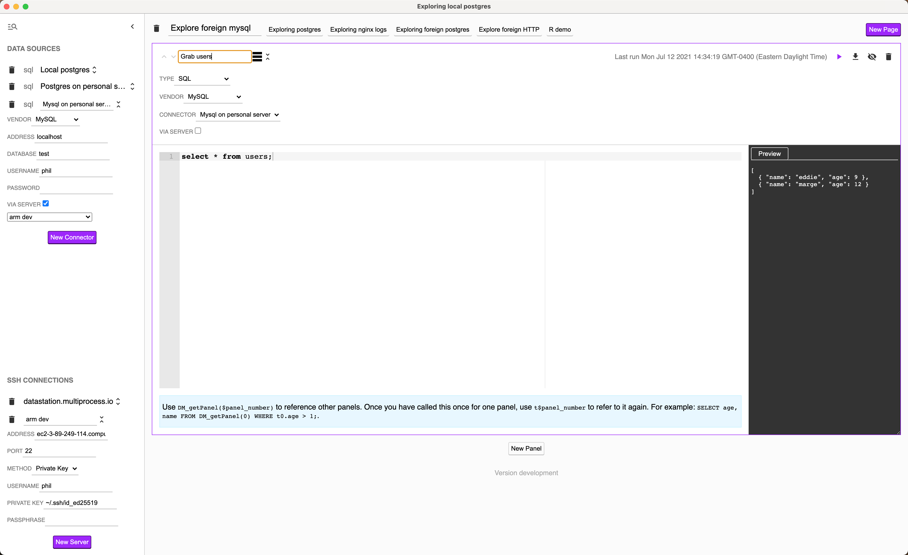

# DataStation Community Edition

DataStation allows you to seamlessly connect SQL queries, HTTP requests,
scripting, and visualization in a single platform.

## Major Features

* Cross-platform: Windows, macOS, and Linux
* Query SQLite, SQL Server PostgreSQL- and MySQL-compatible databases
  * With builtin support for proxying over SSH
* Query HTTP servers
  * With builtin support for proxying over SSH
* Read files from disk
  * Builtin support for parquet, CSV, JSON, and Excel (.xlsx, .xls)
  * Builtin support for parsing Apache2 access and error logs, Nginx access logs, syslogs, and newline-delimited JSON
  * With builtin support for reading over SSH (i.e. SFTP)
* Script against data in Python, JavaScript, Ruby, Julia, and R
* Produce bar graphs and pie charts from data

## Install

Zip files for the latest release provided on the
[releases](https://github.com/multiprocessio/datastation/releases)
page. x86-64 builds for Mac and Windows are available. In the future
this will expand to ARM and Linux.

## Documentation

See [here](https://datastation.multiprocess.io/docs/) for details.

## Community

[Join us on Discord](https://discord.gg/f2wQBc4bXX).

## How can I help?

Download the app and use it! Report bugs on
[Discord](https://discord.gg/f2wQBc4bXX).

If you want to make a fix, see [HACKING.md](HACKING.md).

Before starting on any new feature though, check in on
[Discord](https://discord.gg/f2wQBc4bXX)!

## Subscribe

If you want to hear about new features and how DataStation works under
the hood, [sign up here](https://forms.gle/wH5fdxrxXwZHoNxk8).

## License

This software is licensed under an Apache 2.0 license.
