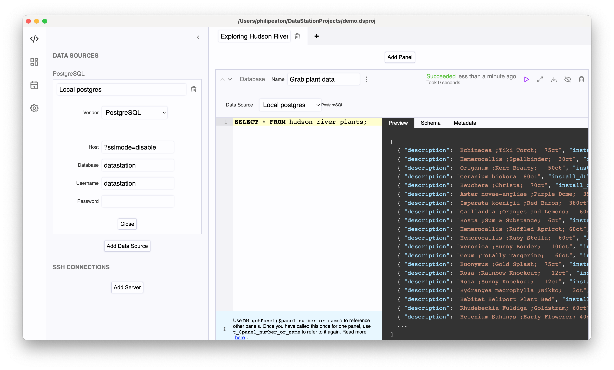
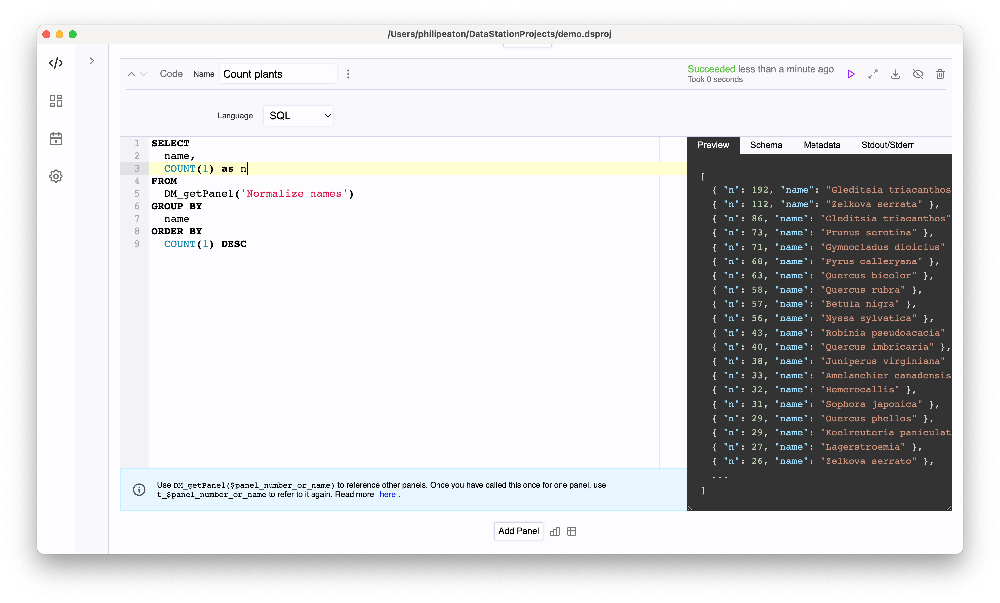
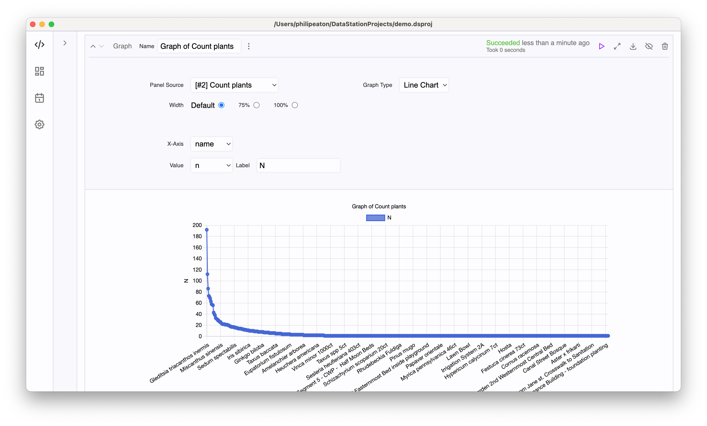
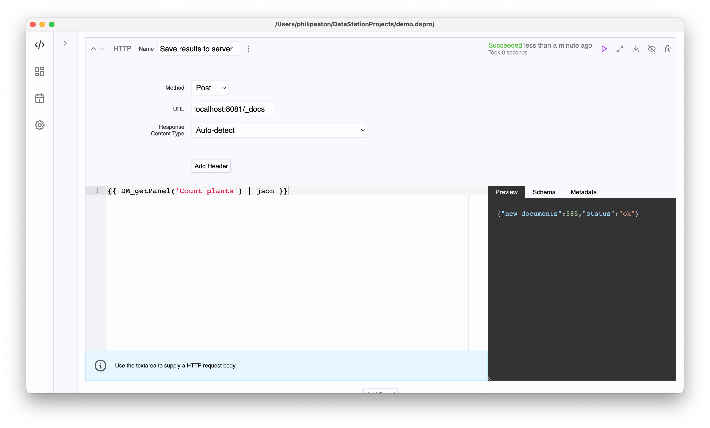

# DataStation Community Edition

## Stay in the loop

Since Github doesn't provide a great way for you to learn about new
releases and features, don't just star the repo, join the [mailing
list](https://docs.google.com/forms/d/e/1FAIpQLSfYF3AZivacRrQWanC-skd0iI23ermwPd17T_64Xc4etoL_Tw/viewform).

## About

DataStation is an open-source data IDE for developers. It allows you
to easily build graphs and tables with data pulled from SQL databases,
logging databases, metrics databases, HTTP servers, and all kinds of
text and binary files. Need to join or munge data? Write embedded
scripts as needed in languages like Python, JavaScript, R or SQL. All in one
application.

## Features

* Build reports with graphs, charts and tables
* Script against data
* Cross-platform: Windows, macOS, and Linux
* Easily fetch your data, wherever it is: 18 SQL and non-SQL databases, files, HTTP servers

### Query databases and files

Over 20 supported databases out of the box including:
[PostgreSQL](https://datastation.multiprocess.io/docs/tutorials/Query_PostgreSQL_with_DataStation.html),
[MySQL](https://datastation.multiprocess.io/docs/tutorials/Query_MySQL_with_DataStation.html),
MariaDB,
[SQLite](https://datastation.multiprocess.io/docs/tutorials/Query_SQLite_with_DataStation.html),
[SQL
Server](https://datastation.multiprocess.io/docs/tutorials/Query_SQL_Server_with_DataStation.html),
[Oracle](https://datastation.multiprocess.io/docs/tutorials/Query_Oracle_with_DataStation.html),
[ClickHouse](https://datastation.multiprocess.io/docs/tutorials/Query_ClickHouse_with_DataStation.html),
[Influx 1
(InfluxQL)](https://datastation.multiprocess.io/docs/tutorials/Query_Influx_(1.x)_with_DataStation_(InfluxQL).html),
[Influx 2
(Flux)](https://datastation.multiprocess.io/docs/tutorials/Query_Influx_(2.x)_with_DataStation_(Flux).html),
[Prometheus](https://datastation.multiprocess.io/docs/tutorials/Query_Prometheus_with_DataStation.html),
[Elasticsearch](https://datastation.multiprocess.io/docs/tutorials/Query_Elasticsearch_with_DataStation.html),
[AWS
Athena](https://datastation.multiprocess.io/docs/tutorials/Query_AWS_Athena_with_DataStation.html),
[Google
BigQuery](https://datastation.multiprocess.io/docs/tutorials/Query_BigQuery_with_DataStation.html),
Snowflake, Cassandra,
[Scylla](https://datastation.multiprocess.io/docs/tutorials/Query_Scylla_with_DataStation.html),
TimescaleDB,
[YugabyteDB](https://datastation.multiprocess.io/docs/tutorials/Query_Yugabyte_with_DataStation.html),
[CockroachDB](https://datastation.multiprocess.io/docs/tutorials/Query_CockroachDB_with_DataStation.html),
CrateDB, QuestDB, and
[Airtable](https://datastation.multiprocess.io/docs/tutorials/Query_Airtable_with_DataStation.html).

[Read more about database panels.](https://datastation.multiprocess.io/docs/latest/Panels/Database_Panels.html)

Over 13 supported file formats including: Avro, Parquet, JSON, JSON
Newline, Concatenated JSON, CSV, TSV, Excel (XLSX), ODS, Apache Error
Logs, Apache Access Logs, Nginx Access Logs, and Newline-delimited
Custom Regexp.

[Read more about file panels.](https://datastation.multiprocess.io/docs/latest/Panels/File_Panels.html)

### Script with code

Python, Ruby, Julia, PHP, Deno, R, JavaScript or SQL are supported scripting languages.

[Read more about code panels.](https://datastation.multiprocess.io/docs/latest/Panels/Code_Panels.html)

### Build graphs

### And export data

[Read more about HTTP panels.](https://datastation.multiprocess.io/docs/latest/Panels/HTTP_Panels.html) Or [read more about macros](https://datastation.multiprocess.io/docs/latest/Panels/Macros.html).

## Install

Install instructions are available [here](https://datastation.multiprocess.io/docs/).

## Learn

Find user guides for all different kinds of databases and scenarios
[here](https://datastation.multiprocess.io/docs/).

## Community

[Join us on Discord](https://discord.gg/f2wQBc4bXX).

## How can I help?

Download the app and use it! Report bugs on
[Discord](https://discord.gg/f2wQBc4bXX).

If you're a developer with some Go experience looking to hack on open
source, check out [GOOD_FIRST_PROJECTS.md](GOOD_FIRST_PROJECTS.md).
